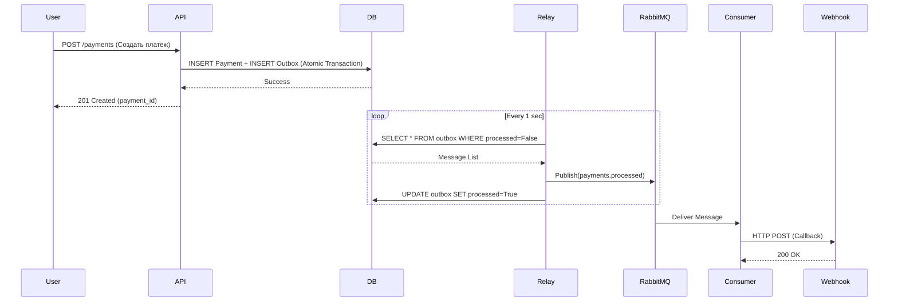
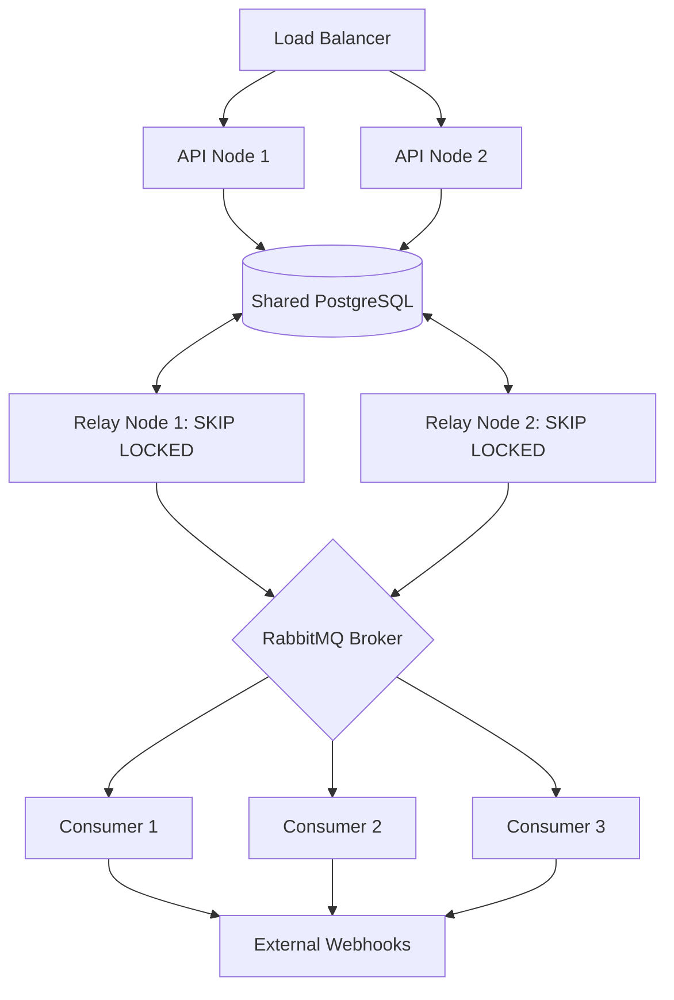

# Архитектурная документация: Взаимодействие сервисов

В данном документе описана архитектура взаимодействия компонентов платежного сервиса в различных режимах развертывания.

## Основные компоненты
1.  **API Service**: Принимает внешние запросы, создает записи о платежах и события в таблице Outbox в рамках одной транзакции.
2.  **Database (PostgreSQL)**: Хранит состояние платежей и очередь Outbox.
3.  **Outbox Relay**: Опрашивает таблицу Outbox и публикует сообщения в RabbitMQ.
4.  **Message Broker (RabbitMQ)**: Обеспечивает передачу сообщений между издателями и подписчиками.
5.  **Consumer (Worker)**: Обрабатывает сообщения из RabbitMQ (бизнес-логика оплаты, отправка вебхуков).

---

## 1. Схема взаимодействия (Single Instance)

При запуске в один экземпляр процесс выглядит как линейная цепочка.

---

## 2. Схема при масштабировании (Multiple Nodes)

При горизонтальном масштабировании (`--scale api=2 --scale relay=2 --scale consumer=3`) система обеспечивает надежность и отсутствие дублей за счет механизмов БД и брокера.

### API Nodes
- Несколько узлов API работают параллельно за Load Balancer.
- **Stateless**: Узлы не знают друг о друге, взаимодействуя только с общей БД.

### Outbox Relay (Scaling via SKIP LOCKED)
- Несколько экземпляров Relay опрашивают одну таблицу.
- **Механизм**: Используется `FOR UPDATE SKIP LOCKED`. Каждый Relay захватывает свою порцию строк, не блокируя остальных. Это исключает дублирование публикации сообщений.

### Consumers (Competing Consumers)
- Несколько воркеров подписаны на одну очередь.
- **Механизм**: RabbitMQ распределяет сообщения между свободными воркерами (Round-robin).
- **Идемпотентность**: Если один и тот же платеж по какой-то причине попал в обработку дважды, воркер проверяет статус в БД и делает Early Return.

---

## Гарантии доставки
- **At-least-once**: Благодаря Transactional Outbox, сообщение гарантированно попадет в RabbitMQ, даже если API упадет сразу после ответа пользователю.
- **Reliability**: Если Relay упадет в середине цикла, транзакция в БД не зафиксируется, и другой экземпляр Relay подхватит эти же сообщения.
- **Scalability**: Система масштабируется линейно добавлением новых узлов без изменения кода.
